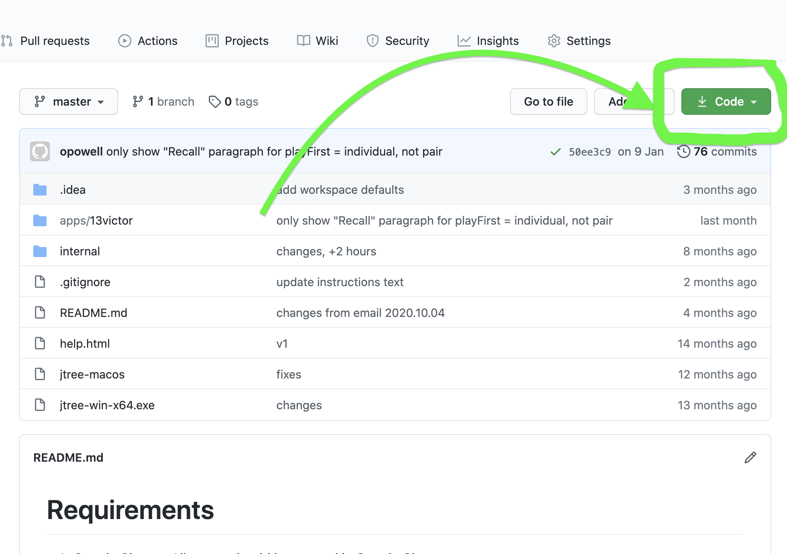

# Requirements
1. Google Chrome
- All pages should be opened in Google Chrome.

# Getting started

1. Download zip (green "Code" button, select "Download ZIP")
   
2. Extract all files and run "jtree-win-x64.exe" or "jtree-macos".
3. Open the "Queues" tab, click the Queue (not blue play button).
4. Set options.
5. Start session.

# WORKLOG since 2020.11.24
* 2020.12.01 - 1 hour
* 2020.12.06 - 3 hours
* 2020.12.20 - 4 hours
* 2021.01.09 - 3 hours
* 2021.02.15 - 6 hours
* 2021.04.04 - 4 hours
## TOTAL - 21 hours